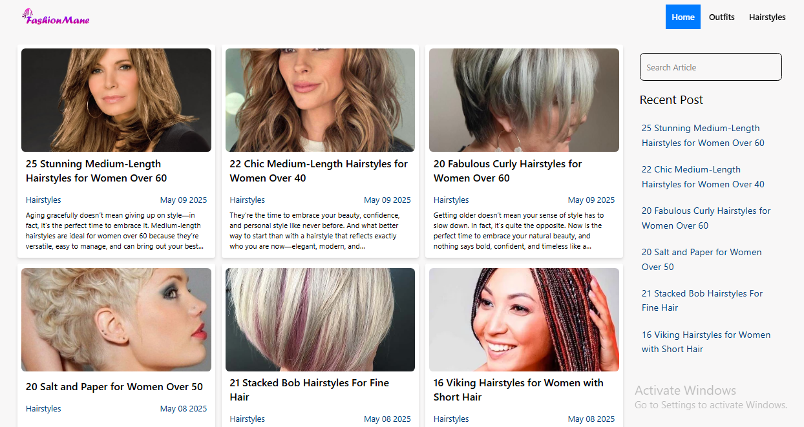

# 🚀 Fashion Blog Platform

A modern, responsive blog platform built with Next.js 15, featuring fashion content management, user authentication, and a beautiful UI with dark/light mode support.



## ✨ Features

- **📝 Blog Management**: Create, edit, and delete blog posts with rich text editor
- **🎨 Modern UI**: Beautiful, responsive design with Tailwind CSS
- **🌙 Dark/Light Mode**: Toggle between themes for better user experience
- **🔐 Authentication**: Secure user authentication with NextAuth.js
- **📱 Responsive Design**: Works perfectly on desktop, tablet, and mobile
- **⚡ Fast Performance**: Built with Next.js 15 and optimized for speed
- **📊 Analytics**: Integrated Google Analytics for insights
- **🎯 SEO Optimized**: Meta tags and structured data for better search visibility

## 🛠️ Tech Stack

- **Frontend**: Next.js 15, React 19, Tailwind CSS
- **Backend**: Next.js API Routes
- **Database**: MongoDB with Mongoose
- **Authentication**: NextAuth.js
- **UI Components**: Framer Motion, Lucide React
- **Rich Text Editor**: Jodit React
- **Analytics**: Vercel Analytics, Google Analytics

## 🚀 Quick Start

### Prerequisites

- Node.js 18+ 
- MongoDB database
- npm or yarn

### Installation

1. **Clone the repository**
   ```bash
   git clone https://github.com/UmairZakria/fashionmane-blog-platform
   cd blog
   ```

2. **Install dependencies**
   ```bash
   npm install
   ```

3. **Environment Setup**
   Create a `.env.local` file in the root directory:
   ```env
   MONGODB_URI=your_mongodb_connection_string
   NEXTAUTH_SECRET=your_nextauth_secret
   NEXTAUTH_URL=http://localhost:3000
   ```

4. **Run the development server**
   ```bash
   npm run dev
   ```

5. **Open your browser**
   Navigate to [http://localhost:3000](http://localhost:3000)

## 📁 Project Structure

```
blog/
├── app/                    # Next.js 13+ app directory
│   ├── api/               # API routes
│   ├── components/        # Reusable components
│   ├── models/           # MongoDB models
│   ├── Panel/            # Admin panel
│   └── Blog/             # Blog pages
├── Context/              # React context providers
├── lib/                  # Utility functions
└── public/              # Static assets
```

## 🎯 Key Features Explained

### Blog Management
- **Create Posts**: Rich text editor with image upload support
- **Edit Posts**: In-place editing with auto-save
- **Delete Posts**: Secure deletion with confirmation
- **Categories**: Organize posts by fashion categories

### User Interface
- **Responsive Design**: Mobile-first approach
- **Theme Toggle**: Switch between light and dark modes
- **Loading States**: Smooth loading animations
- **Search & Filter**: Find posts quickly

### Admin Panel
- **Dashboard**: Overview of all blog posts
- **Post Editor**: WYSIWYG editor for content creation
- **Media Management**: Upload and manage images
- **User Management**: Admin user controls

## 🔧 Available Scripts

```bash
npm run dev      # Start development server
npm run build    # Build for production
npm run start    # Start production server
npm run lint     # Run ESLint
```

## 🌐 API Endpoints

- `POST /api/findblogs` - Get all blog posts
- `POST /api/blogpost` - Create new blog post
- `POST /api/findpost` - Get specific blog post
- `POST /api/deletepost` - Delete blog post
- `GET /api/auth/[...nextauth]` - Authentication routes

## 📱 Screenshots


## 🚀 Deployment

### Vercel (Recommended)
1. Push your code to GitHub
2. Connect your repository to Vercel
3. Add environment variables
4. Deploy automatically

### Other Platforms
- **Netlify**: Configure build settings
- **Railway**: Connect MongoDB and deploy
- **Heroku**: Add buildpacks and environment variables

## 🤝 Contributing

1. Fork the repository
2. Create a feature branch (`git checkout -b feature/amazing-feature`)
3. Commit your changes (`git commit -m 'Add amazing feature'`)
4. Push to the branch (`git push origin feature/amazing-feature`)
5. Open a Pull Request

## 📄 License

This project is licensed under the MIT License - see the [LICENSE](LICENSE) file for details.

## 🙏 Acknowledgments

- Next.js team for the amazing framework
- Tailwind CSS for the utility-first CSS framework
- MongoDB for the database solution
- All contributors and supporters

---

**Made with ❤️ using Next.js and Tailwind CSS**

For support, email: [your-email@example.com](mailto:your-email@example.com)
